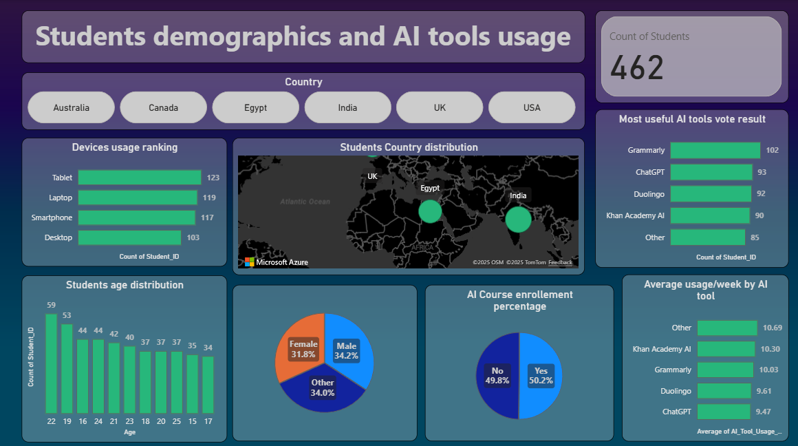
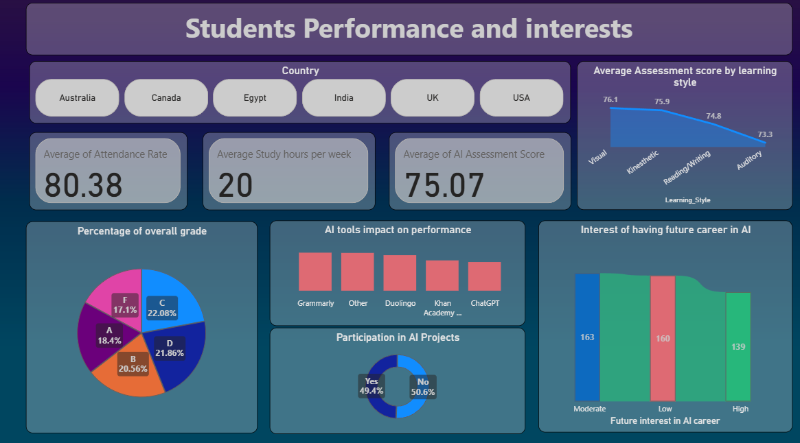
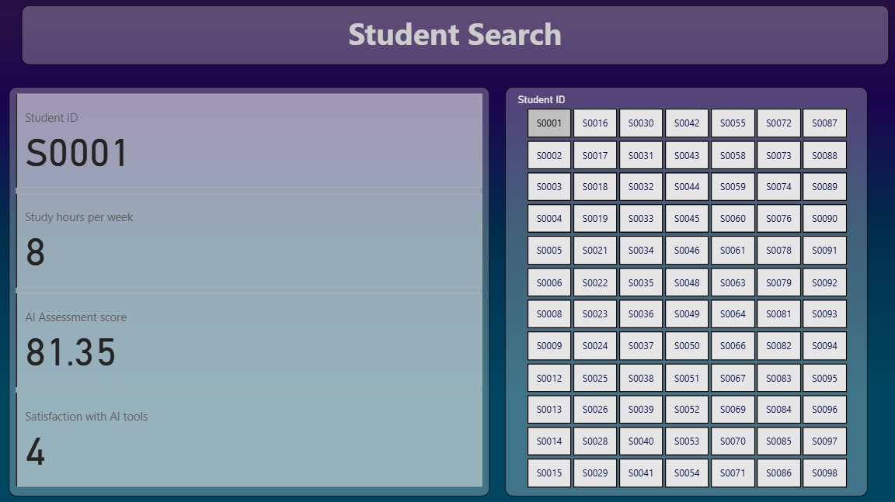

# Learning-platform-analysis
Learning Platform Analytics is a Power BI and Excel project that analyzes student demographics and performance. Data was prepared in Excel and visualized in Power BI dashboards to compare learning outcomes across regions and learning styles, while also highlighting overall student performance trends.

## 📸 Screenshots

